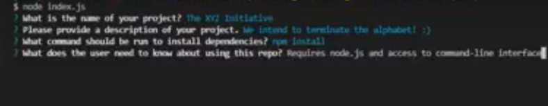

# README-Generator

## Description: 
  This application generates a quality README file from the command-line interface. Users can easily create a polished Markdown file by answering a few questions in a matter of minutes. The prompts are designed to acquire all pertinent information needed to produce a professional product without the hassle of designing one from scratch.
  &nbsp;
  &nbsp;

  &nbsp;
  &nbsp;
## Table of Contents
  - [Installation](#installation)
  - [Usage](#usage)
  - [License](#license)
  - [Contributing](#contributing)
  - [Questions](#questions)

  &nbsp;
  &nbsp;
## Installation:
  1. Clone this repository to a local file.
  2. This application runs on node.js. If you don't have it installed, download [Node.js](https://nodejs.org/en/) (version 16.18.0 LTE).
  3. Using the command-line interface, cd into the directory where you want your README to appear. 
  4. To install necessary dependencies, run the following command:
  >                    npm i
 

  &nbsp;
  &nbsp;
## Usage:
  To create your README, open your command-line interface and run the following command:
  >                  node index.js
  

  Then, answer the questions and view the finished product!
 
  &nbsp;
  &nbsp;

  &nbsp;
  &nbsp;
Example screenshot:
  

  
  &nbsp;
  &nbsp;
  
  &nbsp;
  &nbsp;
Video Walkthrough:

  

  &nbsp;
  &nbsp;
## License:
      This project is licensed under the MIT license.

  &nbsp;
  &nbsp;
## Contributing:
  If you would like to contribute to this project, please push your code to the repo and make a pull request.

  &nbsp;
  &nbsp;
## Questions:
  If you have questions about this project, please contact me at [jkanvision@knights.ucf.edu](mailto:jkanvision@knights.ucf.edu).  You can view my other projects by visiting my GitHub profile: [https://github.com/jkanvision](https://github.com/jkanvision).